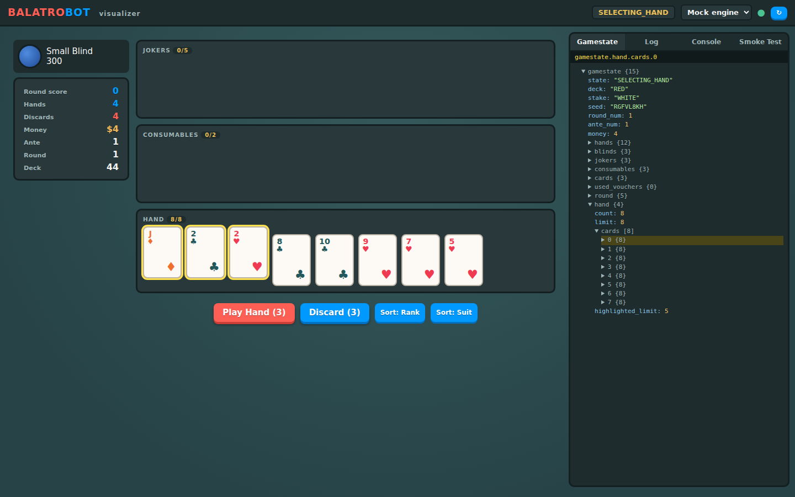

# Gamestate Visualizer

A browser-based visualizer that recreates Balatro's screens — main menu, run
setup (deck/stake), blind select, gameplay, round eval, shop, and booster
pack — and binds every visual element to the game state returned by the
BalatroBot API. It doubles as an interactive test harness for all API
endpoints.



## Quick start

```bash
# Serve the visualizer (defaults: UI on 127.0.0.1:12348, game on 12346).
# Requires a running game; raises GameServerUnavailable otherwise.
uvx balatrobot ui --open

# Point it at a game running on another port
uvx balatrobot ui --game-port 22222

# Replay a previously learned gamestate graph without a game
uvx balatrobot ui --mock

# Inspect every screen and validate API request shapes using synthetic fixtures
uvx balatrobot ui --fixture --open
```

Transport modes (top bar):

- **Live game** (default): JSON-RPC calls are proxied to a running game
    instance. The game's HTTP server sends no CORS headers, so the visualizer
    server forwards `POST /rpc` on the browser's behalf. Startup health-checks
    the game and fails if it is unreachable.
- **Graph mock** (`--mock`): an in-browser transport that replays gamestate
    transitions previously observed from a real game (see below). It is not a
    Balatro simulation: with no learned graph every call fails with
    `MOCK_GRAPH_EMPTY`, and only transitions recorded from live play are
    available (`MOCK_TRANSITION_UNKNOWN` otherwise).
- **Fixture contract** (`--fixture`): an offline JSON-RPC endpoint backed by
    deterministic synthetic gamestates for every visualized screen. Use the
    fixture-state selector in the top bar to inspect screens, and the Console
    tab to validate method names and parameter shapes against the packaged
    OpenRPC contract. Calls do not mutate fixtures or simulate game rules.

## Fixture contract mode

Fixture mode sends calls to the local `/fixture-rpc` endpoint instead of a
Balatro process. It validates required and unknown parameters, primitive and
array types, minimums, and OpenRPC `enum`/`const`/`oneOf` constraints. Successful
gamestate-returning methods return the currently selected fixture unchanged,
with `fixture.synthetic: true` and the last method name.

The packaged fixture contract is kept in sync with
`src/lua/utils/openrpc.json`. Fixture mode tests the visualizer's JSON-RPC
integration and API contract; it does **not** verify the Lua endpoint
implementation or Balatro behavior. The full-loop Smoke Test is therefore
disabled in fixture mode—use the Console tab to exercise individual methods.

## Learned gamestate graphs

While in live mode, the visualizer server records every successful RPC
response that carries a `gamestate.state` into a transition graph:

- **Nodes** are `gamestate.state` enum values observed from the real game.
- **Edges** are the RPC methods whose success moved the game from one state
    to another, with observation counts and timestamps.

The graph is written to `gamestate_graphs/state_graph.json` (plus a Graphviz
`state_graph.dot`; render it with `gamestate_graphs/render_svg.sh`). Options:

- `--graph PATH` — record to / replay from a different graph file.
- `--verbose` — additionally store the last params/results and recent samples
    on each edge (default `--compact` keeps the graph structural).

Mock mode loads this graph via `/state-graph.json` and only replays what was
learned, so the mock's picture of the game structure is derived from real
gameplay rather than hand-authored guesses.

## What's on screen

- **Game screens**: each game state routes to a recreation of the screen a
    player would see. Buttons on each screen call the endpoints that are valid
    in that state (`select`/`skip` on blind select, `play`/`discard`/`use`/
    `sell`/`rearrange` during play, `buy`/`reroll`/`next_round` in the shop,
    `pack` in an opened booster, `cash_out` on round eval, `start` from the
    menu).
- **Gamestate tab**: live JSON tree of the `gamestate` response. Hover any
    card, counter, or area on the screen to highlight the exact JSON path that
    drives it (and vice versa: hover a JSON node to highlight the matching
    screen elements).
- **Log tab**: every JSON-RPC request/response with timing and error names.
- **Console tab**: form-based caller for any endpoint; the method list and
    parameters come from `rpc.discover` (in mock mode, only learned methods
    are listed; in fixture mode, the packaged OpenRPC contract is used).
- **Smoke Test tab**: a scripted sequence that walks a full game loop and
    exercises every endpoint, reporting pass/fail per step. Meant for live
    mode; in mock mode steps fail unless their transitions have been learned,
    and in fixture mode it is disabled because fixtures do not transition.

## Scripting hook

`window.__bbviz.ctx.call(method, params)` drives the UI programmatically from
the browser console or automation tooling and re-renders after each call.

## Caveats

- The graph mock replays observed state transitions only. It returns minimal
    gamestates (`state` plus graph metadata), so screens render their structure
    but not full card data.
- Fixture payloads are synthetic examples for UI inspection, not captured
    Balatro output and not evidence that an endpoint works in-game.
- The visualizer server binds to localhost by default; it is a development
    tool and has no authentication.
